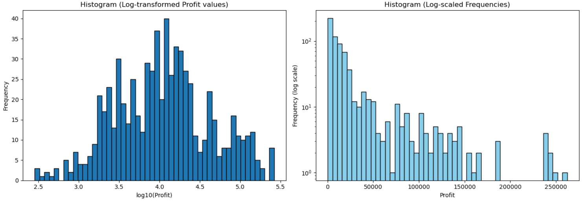
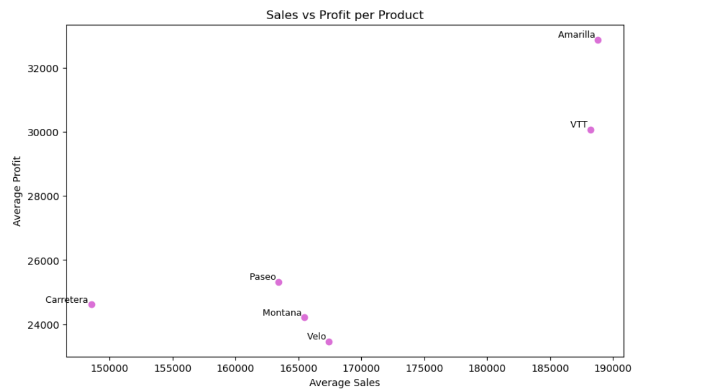
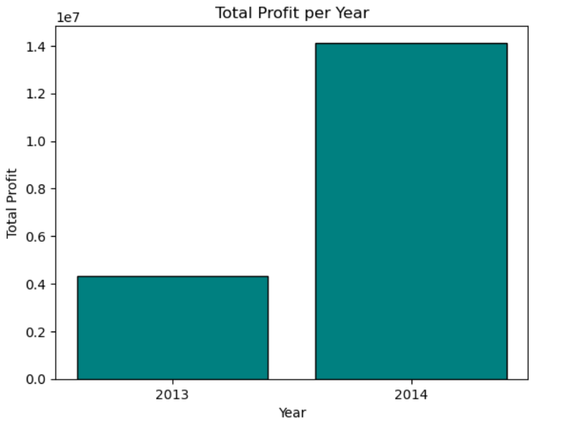
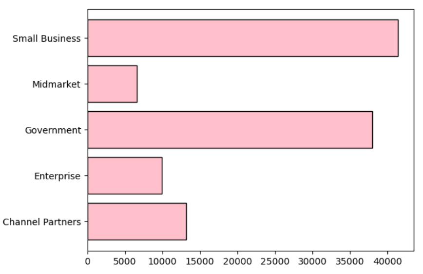
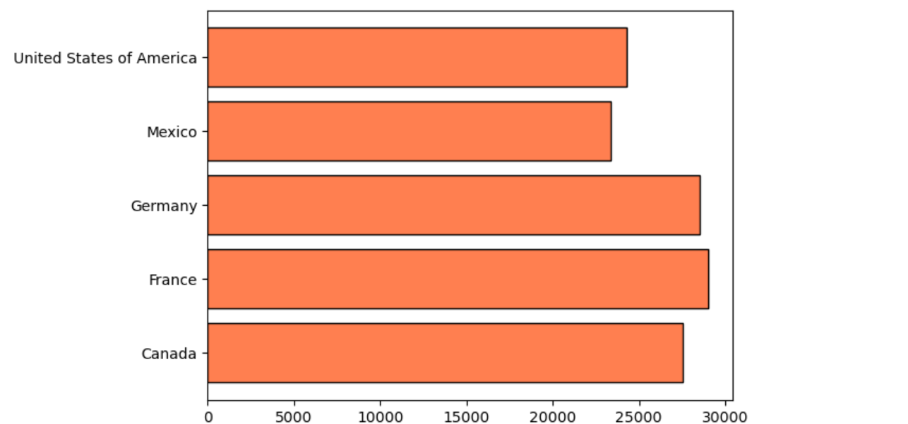
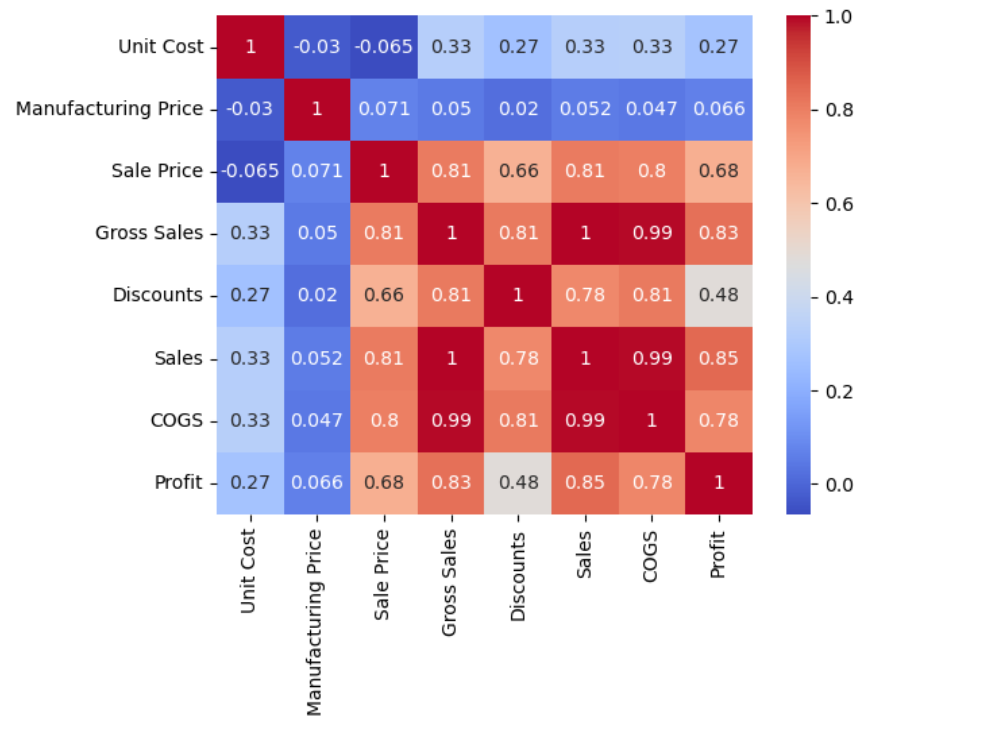
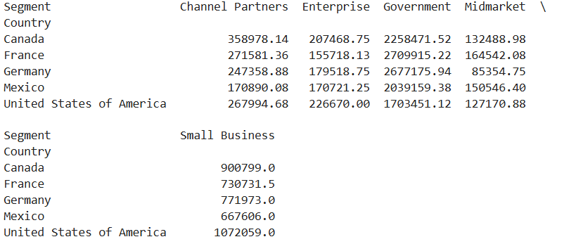

# 📊 Sales Data EDA Project

## 📌 Project Overview
This project is an **Exploratory Data Analysis (EDA)** of a sales dataset.  
The goal was to clean the data, explore trends, visualize insights, and practice using **pandas**, **matplotlib**, and **seaborn** for data analysis and visualization.

---

## 🔑 Objectives
- Clean and preprocess raw sales data.
- Explore sales, profit, costs, and units sold across different dimensions.
- Perform descriptive statistics to summarize the dataset.
- Visualize trends and insights using various plots (bar charts, histograms, scatter plots, heatmaps).
- Practice grouping, pivot tables, and correlations.

---

## 🛠️ Tools & Libraries
- Python 3.x  
- pandas  
- matplotlib  
- seaborn  
- Jupyter Notebook  

---

## 📂 Dataset
- **Name:** Financials.csv
- **Source:** Kaggle 
- **Rows/Columns:** 700 rows × 10 columns  
- **Key Columns:** `Year`, `Country`, `Segment`, `Sales`, `Profit`, `COGS`, `Units Sold`

---

## 📈 Exploratory Analysis & Insights
Some key steps in the analysis:
1. **Data Cleaning:** Removed `$` and `,` symbols, converted columns to numeric types.
2. **Descriptive Stats:** Summarized sales, profit, and costs distributions.
3. **Univariate Analysis:** Histograms & boxplots of `Profit` and `Sales`.
4. **Categorical Analysis:** Sales & profit by country, year, and segment.
5. **Bivariate Analysis:** Scatter plots and correlations between `Sales` and `Profit`.
6. **Pivot Tables & Heatmaps:** Showed relationships between multiple variables.

---

## 📊 Results & Visualizations


### Profit Distribution



### Sales vs Profit



### Total Profit Per Year



### Profit by Segment



### Profit by Country



### Heatmap



### Pivot Table

---

## 🔍 Key Findings
- Profit distribution is highly skewed (most sales yield smaller profits, a few yield very large profits).  
- France had the highest total profits, while Mexico had the lowest.  
- The small business segment consistently generated higher average profits.  
- Positive correlation between `Sales` and `Profit`.  

---

## 📌 How to Run
1. Clone this repository:  
   ```bash
   git clone https://github.com/Niharika-S-Sharma/EDA-SalesAnalysis.git
